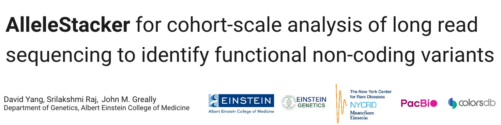

 

# AlleleStacker

AlleleStacker is a python-based toolkit for identifying functional non-coding variants (fNCVs) from PacBio 5-base long-read sequencing. 

## Overview

The pipeline consists of several key components:
1. Quality control of CpG methylation pileups generated by [pb-CpG-tools](https://github.com/PacificBiosciences/pb-CpG-tools) (v2.3.2)
2. Methylation segmentation of individual genomes w/ [MethBat] (https://github.com/PacificBiosciences/MethBat.git) (v0.13.2)
3. Candidate region generation from binarized segmentation calls. 
4. Variant mapping to candidate regions

## Installation

### Requirements

- Python 3.8+
- conda/mamba environment manager
- SLURM workload manager (for cluster execution)

### Dependencies

```bash
conda create -n allele_stacker
conda activate allele_stacker
conda install -c bioconda bcftools pysam tabix
conda install pandas numpy scikit-learn matplotlib seaborn tqdm
```

## *Components (incomplete sections below)*

### 1. Consensus Region Generator

Identifies consensus methylation regions across samples with haplotype specificity.

```bash
python consensus_regions.py \
  --input_dir /path/to/methylation/data \
  --output_prefix consensus \
  --output_dir /path/to/output \
  --sample-list-file samples.txt \
  --max-gap 5000 \
  --min-samples 2
```

Key features:
- Processes H1 and H2 haplotypes separately
- Merges overlapping regions with configurable gap size
- Tracks sample-specific contributions

### 2. Variant Mapper

Maps genetic variants to methylation regions with haplotype awareness.

```bash
python variant_mapper.py \
  --bed regions.bed \
  --haplotype H1 \
  --output results.tsv \
  --small-vcf variants.vcf.gz \
  --cnv-vcf cnvs.vcf.gz \
  --sv-vcf svs.vcf.gz \
  --tr-vcf repeats.vcf.gz
```

Supports multiple variant types:
- Small variants (SNPs/indels)
- Copy number variants (CNVs)
- Structural variants (SVs)
- Tandem repeats (TRs)

### 3. PCA Analysis

Performs principal component analysis on methylation data.

```bash
python run_pca.py \
  --input-dir /path/to/bed/files \
  --output-dir /path/to/output
```

Features:
- Generates PCA plots
- Calculates variance explained
- Outputs loadings and scores

### 4. VCF Processing Tools

Scripts for merging and filtering VCF files:

```bash
python vcf_merge.py \
  --input-vcfs vcf_list.txt \
  --output merged.vcf.gz

python vcf_filter.py \
  --input merged.vcf.gz \
  --output filtered.vcf.gz \
  --qual 20 \
  --depth 10
```

## Execution

### Interactive Testing

For quick tests on small datasets:

```python
from allele_stacker import TestMapper

mapper = TestMapper('output_prefix')
mapper.test(
    h1_bed='h1_regions.bed',
    h2_bed='h2_regions.bed',
    sample_size=50
)
```

### SLURM Submission

Example submission script:

```bash
#!/bin/bash
#SBATCH --partition=normal
#SBATCH --nodes=1
#SBATCH --mem=64gb
#SBATCH --time=2-00:00:00
#SBATCH --cpus-per-task=4

source /public/apps/conda3/etc/profile.d/conda.sh
conda activate anc_vig

python variant_mapper.py [args...]
```

## Output Files

### Consensus Regions
- `{prefix}_H1_consensus.bed`: H1 consensus regions
- `{prefix}_H2_consensus.bed`: H2 consensus regions
- `{prefix}_statistics.tsv`: Region statistics

### Variant Mapping
- `variants_H1.tsv`: H1 variant mappings
- `variants_H2.tsv`: H2 variant mappings
- `{prefix}_stats.txt`: Mapping statistics

### PCA Results
- `pc_scores.csv`: Principal component scores
- `pca_loadings.csv`: Feature loadings
- `variance_explained.csv`: Explained variance ratios
- `plots/`: PCA visualization plots

## File Formats

### BED Files
```
chrom  start  end  score  hap  depth  meth_count  unmeth_count  meth_pct
```

### Variant Mapping Output
```
chrom  start  end  variant_id  type  ref  alt  num_samples  meth_samples  unmeth_samples
```

## Performance Notes

- Uses parallel processing for region analysis
- Supports memory-efficient processing of large VCF files
- Configurable thread count for cluster environments

## Troubleshooting

Common issues:
1. Missing VCF indices: Run `tabix -p vcf file.vcf.gz`
2. Sample name mismatches: Check for consistent naming between files
3. Memory errors: Adjust batch size and worker count

## License

Academic use only. Contact authors for permissions.